# 26s-w2-c2-07

## 공통과제 II : 협업형 실전 산출물 제작 (2인 1팀)

**목적:** 실시간 인터랙션, LLM Wrapper, Cross-Platform 중 하나의 옵션을 선택해 구현하며, 선택한 기술을 실제로 동작하는 형태의 산출물로 완성한다.

**선택 옵션:**

| 옵션 | 설명 |
|---|---|
| 실시간 인터랙션 | 사용자 간 상태 변화, 실시간 데이터 흐름, 스트리밍 응답 등 실시간성이 드러나는 기능을 구현 |
| LLM Wrapper | LLM API를 활용하여 AI 기능이 포함된 산출물을 구현 |
| Cross-Platform | 하나의 산출물을 여러 실행 환경에서 사용할 수 있도록 구현* |

> *데스크톱 앱 ↔ 모바일 앱; 혹은 다른 폼팩터에서의 앱; 웹만/웹 기반 프레임워크(Electron, Tauri 등) 대신 다른 프레임워크를 시도해보는 것을 적극 권장

**결과물:** 선택한 옵션이 적용된 작동 가능한 산출물, 실행 가능한 코드, 시연 자료 및 관련 문서

---

## 팀원

| 이름 | 학교 | GitHub | 역할 |
|---|---|---|---|
| 양우현 | KAIST | [hyun020215](https://github.com/hyun020215) | 기획, 웹 프론트엔드, 모바일·데스크탑 클라이언트, QA |
| 이서영 | 성균관대학교 | [sksy930](https://github.com/sksy930) | 백엔드, Supabase, API 설계, QA |

---

## 선택 옵션

- [ ] 실시간 인터랙션
- [ ] LLM Wrapper
- [x] Cross-Platform

---

## 기획안

### 서비스 개요

| 항목 | 내용 |
|---|---|
| 서비스명 | Nook |
| 한 줄 소개 | 일상의 글감이 원고가 되는 따뜻하고 미니멀한 글쓰기 작업실 |
| 핵심 가치 | 모바일에서 빠르게 수집하고, 웹/데스크탑에서 차분하게 정리하고, 프로젝트와 원고로 발전시킨다. |
| 디자인 방향 | Brunch의 여백감은 참고하되, Nook만의 따뜻한 갈색 팔레트와 편안한 종이 질감을 중심으로 구성 |
| 선택 옵션 | Cross-Platform |

### 문제 정의와 해결 방향

| 문제 | 해결 방향 | 구현 화면/기능 |
|---|---|---|
| 문장, 사진, 링크가 여러 앱에 흩어짐 | 같은 계정의 글감함으로 통합 수집 | 모바일 홈/글감 추가, 웹·데스크탑 글감함 |
| 수집한 자료가 글쓰기까지 이어지지 않음 | 프로젝트와 원고에 글감을 연결하고 삽입 | 프로젝트 상세, 원고 수정 화면 |
| 모바일은 수집에 강하지만 긴 글 작성은 불편함 | 모바일은 빠른 수집, 웹·데스크탑은 원고 편집 중심 | Flutter 앱, Next.js 웹, Electron 데스크탑 |
| 좋은 글감을 혼자만 보관함 | 공유 글감 서핑과 내 글감함 저장 제공 | 글감 서핑 탭, 신고/저장 흐름 |
| 네트워크가 불안정할 때 데스크탑 사용성이 떨어짐 | 데스크탑 앱은 로컬 파일 큐를 두고 추후 동기화 | Electron preload/offline queue |

### 핵심 구현 요소

| 영역 | 구현 내용 |
|---|---|
| 인증·프로필 | Supabase Auth 기반 Google 로그인, 프로필 조회/수정, 로그아웃, 회원 탈퇴 |
| 글감 수집 | 조각글·사진·동영상·링크 생성, 수정, 삭제, 다중 태그, 공유 여부 설정 |
| 글감함 | 검색, 태그 필터, 리스트/카드 보기, 태그 관리, 상세 수정 |
| 프로젝트 | 진행 중/완료 섹션, 프로젝트 생성/수정/삭제, 상태 전환, 글감 연결/해제 |
| 원고 | 복수 원고, 자동 저장 전제, 연결 글감 섹션, 전체 글감 검색/삽입, 완료 프로젝트 편집 제한 |
| 글감 서핑 | 공유 글감 카드 탐색, 텍스트 검색, 상세 모달, 내 글감함 추가, 신고 확인 모달 |
| 내보내기 | 완료 프로젝트에 한해 PDF·DOCX·TXT 다운로드 |
| Cross-Platform | 웹, Flutter 모바일, Electron 데스크탑이 동일 API 계약과 인증 토큰 사용 |

### 사용 / 시연 시나리오

1. Google 계정으로 로그인한다.
2. 모바일에서 떠오른 문장, 사진, 동영상, 링크를 태그와 함께 저장한다.
3. 웹 또는 데스크탑 글감함에서 글감을 검색하고 상세 내용을 수정한다.
4. 프로젝트를 만들고 필요한 글감을 연결한다.
5. 원고 수정 화면에서 이미 연결된 글감과 모든 글감을 나누어 탐색하며 본문에 삽입한다.
6. 프로젝트를 완료 상태로 바꾼 뒤 PDF·DOCX·TXT로 내보낸다.
7. 글감 서핑에서 다른 사용자의 공유 글감을 검색하고 내 글감함에 저장하거나 신고한다.

### 개발 일정

| 날짜 | 목표 | 산출물 |
|---|---|---|
| Day 1 | 저장소·Supabase·인증·공통 레이아웃 구성 | 기본 앱 셸, 환경 변수, 로그인 흐름 |
| Day 2 | 글감 CRUD, 사진/동영상 업로드, 링크 미리보기 | 글감 추가·상세·수정, Storage 연동 |
| Day 3 | 태그, 프로젝트, 프로젝트-글감 연결 | 태그 관리, 프로젝트 상세, 연결 모달 |
| Day 4 | 복수 원고, 자동 저장, 전체 글감 검색·삽입 | 원고 편집 화면, 완료 프로젝트 제한 |
| Day 5 | 모바일 수집 화면과 웹·모바일 데이터 연동 | Flutter 앱, 캐싱, 기본 오류 컴포넌트 |
| Day 6 | 공유 글감 서핑, 설정, 프로필, 내보내기 | 서핑 탭, 신고/저장, PDF·DOCX·TXT |
| Day 7 | Electron 데스크탑, 반응형 수정, 문서화, QA | 데스크탑 앱, README, 회귀 테스트 |

---

## 구현 명세서

### 필수 기능

- [x] Google 로그인 / 세션 유지 — Supabase Auth access token을 웹·모바일·데스크탑에서 동일하게 사용
- [x] 내 프로필 조회·수정 — 로그인 계정의 이름, 프로필 이미지, 설정을 프로필 화면과 연동
- [x] 로그아웃 / 회원 탈퇴 — 모바일과 웹에서 확인 모달을 거친 뒤 실행
- [x] 글감 생성 / 조회 / 수정 / 삭제 — 조각글·사진·동영상·링크 타입 지원
- [x] 글감 작성 중 새 태그 생성 및 다중 태그 연결 — `tagIds` 기반으로 태그 목록 전체 교체
- [x] 글감함 검색·필터 — 제목, 내용, 태그, 타입 기준 검색과 리스트/카드 보기 전환
- [x] 프로젝트 생성 / 수정 / 삭제 — 진행 중(`active`)과 완료(`done`) 상태만 사용
- [x] 프로젝트 글감 연결 / 해제 — 모든 글감을 검색해 프로젝트에 연결하고 중복 연결 방지
- [x] 복수 원고 생성 / 수정 / 삭제 — 프로젝트 안에 여러 원고를 두고 원고별 편집 가능
- [x] 원고 편집 화면의 글감 연결 — 이미 연결된 글감과 모든 글감을 섹션으로 나누고 연결 글감 섹션은 접기/펼치기 지원
- [x] 완료 프로젝트 편집 제한 — 완료 상태에서는 원고 생성, 글감 추가, 원고 수정 비활성화
- [x] Cross-Platform 동기화 — 모바일에서 수집한 글감을 웹·데스크탑에서 같은 계정으로 확인
- [x] Electron 데스크탑 앱 — 웹 UI를 동일하게 로드하고 개발 서버/번들 서버 모두 지원

### 선택 기능 / 차별화 기능

- [x] 글감 서핑 — 다른 사용자가 공유한 글감을 Pinterest식 카드 UI로 검색·탐색
- [x] 공유 글감 내 글감함에 추가 — 원본 글감을 복사해 내 글감으로 저장
- [x] 공유 글감 신고 — 신고 확인 모달을 거쳐 중복 신고를 막고 누적 시 노출 제한
- [x] 완료 프로젝트 내보내기 — PDF·DOCX·TXT 형식 다운로드
- [x] 원고 다크 에디터 — 앱 전체 다크 모드가 아니라 원고 수정 화면에만 적용되는 설정
- [x] 데스크탑 오프라인 큐 — 백엔드 연결 실패 시 로컬 파일에 작업을 임시 저장할 수 있는 기반
- [x] 데스크탑 스플래시 / 로딩 안정화 — Nook 로고와 캐치프레이즈를 먼저 보여주고 웹 화면 준비 후 전환
- [ ] 알림 실시간 전달 — 공유 글감 저장·신고·노출 제한 알림의 DB/실시간 전달은 백엔드 TODO
- [ ] 서버 측 원고 생성 멱등성 — 프론트 중복 클릭 방어는 구현했으나 `clientRequestId` 기반 서버 멱등 처리는 TODO

### 플랫폼별 구현 범위

| 기능 | Web | Mobile | Desktop |
|---|---:|---:|---:|
| 로그인 / 세션 유지 | ✅ | ✅ | ✅ |
| 글감 추가 / 수정 / 삭제 | ✅ | ✅ | ✅ |
| 태그 관리 | ✅ | ✅ | ✅ |
| 글감 서핑 / 신고 / 저장 | ✅ | ✅ | ✅ |
| 프로젝트 목록 / 상세 | ✅ | ✅ | ✅ |
| 원고 편집 | ✅ | ✅ | ✅ |
| 완료 프로젝트 내보내기 | ✅ | ✅ | ✅ |
| 프로필 / 설정 | ✅ | ✅ | ✅ |
| 오프라인 큐 | - | - | ✅ |

---

## 아키텍처

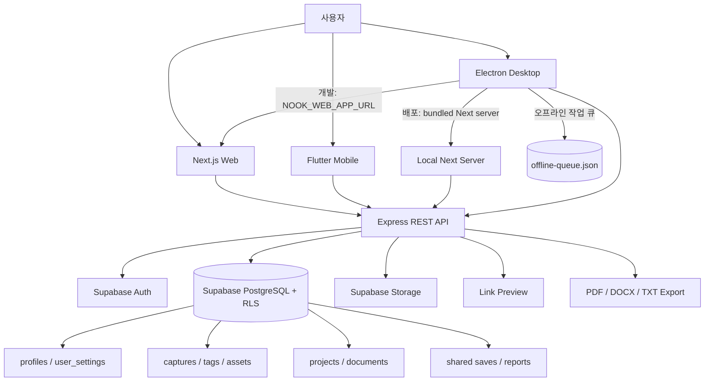

| 계층 | 역할 | 주요 기술 |
|---|---|---|
| Web Client | 글감함, 프로젝트, 원고 편집, 설정, 글감 서핑 | Next.js, TypeScript, CSS |
| Mobile Client | 빠른 글감 수집, 글감함, 프로젝트 확인, 서핑 | Flutter, Dart, Supabase Flutter |
| Desktop Client | 웹과 동일한 UI를 데스크탑 앱으로 제공, 로컬 큐 보관 | Electron, bundled Next server |
| API Server | 인증 토큰 검증, 소유권 검증, CRUD, 내보내기 | Node.js, Express, Zod |
| Data Layer | 사용자 데이터, 파일, 인증 세션 저장 | Supabase Auth, PostgreSQL, Storage, RLS |

웹·모바일·데스크탑은 동일한 REST API 계약을 사용한다. API 서버가 service-role 키를 사용하더라도 repository 레벨에서 `user_id`와 `project_id` 필터를 강제하고, PostgreSQL RLS 정책도 유지해 이중 보호한다.

---

## 설계 문서

> 프로젝트 성격에 따라 필요한 항목만 작성

### 화면 / 인터페이스 설계

#### IA 구조

```text
Nook
├─ 인증
│  ├─ 로그인
│  └─ 세션 유지 / 로그아웃 / 회원 탈퇴
├─ 홈
│  ├─ 최근 글감
│  ├─ 진행 중 프로젝트 요약
│  └─ 알림 팝업
├─ 글감함
│  ├─ 글감 목록
│  │  ├─ 리스트 보기
│  │  └─ 카드 보기
│  ├─ 글감 추가
│  │  ├─ 조각글
│  │  ├─ 사진
│  │  ├─ 동영상
│  │  └─ 링크
│  ├─ 글감 상세 / 수정
│  └─ 태그 생성 / 삭제
├─ 글감 서핑
│  ├─ 공유 글감 카드 검색
│  ├─ 공유 글감 상세 모달
│  ├─ 내 글감함에 추가
│  └─ 신고
├─ 프로젝트
│  ├─ 진행 중
│  │  ├─ 프로젝트 상세
│  │  ├─ 글감 연결 / 해제
│  │  └─ 원고 작성 / 수정
│  └─ 완료
│     ├─ 읽기 전용 원고
│     └─ PDF / DOCX / TXT 내보내기
├─ 프로필
│  ├─ 사용자 정보 수정
│  ├─ 로그아웃
│  └─ 회원 탈퇴
└─ 설정
   ├─ 글감 알림
   └─ 원고 다크 에디터
```

#### 플랫폼별 화면

| 플랫폼 | 화면 | 설계 포인트 |
|---|---|---|
| Web | 홈, 글감함, 글감 추가/상세/수정, 서핑, 프로젝트 목록/상세, 원고 편집, 프로필, 설정 | 넓은 화면에서 프로젝트와 원고 작업을 중심으로 배치 |
| Mobile | 홈, 글감 추가, 글감함, 글감 상세/수정, 서핑, 프로젝트, 원고 수정, 프로필 | 빠른 수집과 한 손 조작을 우선, 원고 편집은 전체 폭 중심 |
| Desktop | Web과 동일 화면 | Electron에서 웹 UI를 그대로 렌더링해 학습 비용 최소화 |

#### 주요 UI 규칙

| 화면/기능 | 규칙 |
|---|---|
| 좌측 메뉴 | 웹/데스크탑은 홈, 글감함, 글감 서핑, 프로젝트, 설정을 제공한다. 프로필은 우측 상단 메뉴에서 진입한다. |
| 글감 연결 | 프로젝트 상세과 원고 수정에서 모든 글감을 검색할 수 있다. 원고 수정은 `이미 연결된 글감`과 `모든 글감` 섹션을 나누고 연결 섹션은 접고 펼친다. |
| 프로젝트 상태 | `진행 중(active)`과 `완료(done)`만 사용한다. 상태 변경은 프로젝트 수정 폼이 아닌 별도 버튼으로 수행한다. |
| 완료 프로젝트 | 원고 생성, 글감 추가, 원고 수정은 비활성화하고 내보내기만 허용한다. |
| 공유 글감 | 서핑 탭은 카드 보기만 지원한다. 상세 모달에서 내 글감함 추가와 신고를 제공한다. |
| 설정 | 모바일 자동 동기화와 자동 저장은 기본값으로 항상 켜져 있어 설정에서 제거한다. |
| 톤앤매너 | 따뜻한 갈색 팔레트, 종이 배경, 낮은 대비의 선과 버튼으로 편안한 글쓰기 분위기를 유지한다. |

### 데이터 구조

> 아래 내용은 실제 마이그레이션(`apps/backend/supabase/migrations/0001~0005`)과 현재 프론트/API 계약을 기준으로 정리한 스키마다.

#### ERD

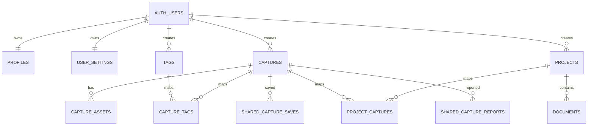

#### DB 스키마

| 테이블 | 주요 컬럼 | 관계 | 설명 |
|---|---|---|---|
| `profiles` | `id`, `display_name`, `avatar_url`, `notify_enabled`, `dark_editor` | `auth.users` 1:1 | 로그인 계정의 서비스 프로필과 일부 설정 저장 |
| `user_settings` | `user_id`, `capture_alerts_enabled`, `dark_editor_enabled` | `auth.users` 1:1 | 설정 API용 사용자 환경값 |
| `captures` | `id`, `user_id`, `type`, `content`, `url`, `link_*`, `is_shared`, `shared_visibility` | 사용자 1:N | 조각글·사진·동영상·링크 글감 본문과 공유 상태 |
| `capture_assets` | `id`, `capture_id`, `storage_path` | 글감 1:N | 사진/동영상 파일의 Supabase Storage 경로 |
| `tags` | `id`, `user_id`, `name`, `color` | 사용자 1:N | 사용자별 태그, `(user_id, name)` unique |
| `capture_tags` | `capture_id`, `tag_id` | 글감 N:M 태그 | 한 글감에 여러 태그 연결, 복합 PK로 중복 방지 |
| `projects` | `id`, `user_id`, `title`, `description`, `status` | 사용자 1:N | 진행 중/완료 프로젝트 |
| `project_captures` | `project_id`, `capture_id` | 프로젝트 N:M 글감 | 프로젝트에 사용할 글감 연결 |
| `documents` | `id`, `project_id`, `user_id`, `title`, `content` | 프로젝트 1:N | 프로젝트 안의 여러 원고 |
| `shared_capture_saves` | `capture_id`, `user_id`, `created_at` | 공유 글감 N:M 저장 사용자 | 다른 사용자가 공유 글감을 내 글감함에 담은 기록 |
| `shared_capture_reports` | `id`, `capture_id`, `reporter_id`, `reason` | 공유 글감 N:M 신고 사용자 | 중복 신고 방지, 누적 시 노출 제한 |

#### 상태·제약 조건

| 대상 | 규칙 |
|---|---|
| 글감 타입 | `text`, `photo`, `link`, `video`만 허용 |
| 프로젝트 상태 | `active`, `done`만 허용. `archived`는 사용하지 않음 |
| 공유 노출 상태 | `visible`, `limited`만 허용. 신고 누적 시 `limited`로 변경 |
| 태그 중복 | 같은 사용자는 같은 이름의 태그를 중복 생성할 수 없음 |
| 글감-태그 연결 | `(capture_id, tag_id)` 복합 PK로 중복 연결 방지 |
| 프로젝트-글감 연결 | `(project_id, capture_id)` 복합 PK로 중복 연결 방지 |
| 원고 생성 멱등성 | 프론트는 중복 클릭을 막지만 서버 `clientRequestId` 기반 멱등 처리는 TODO |

#### 데이터 규칙

- `profiles.id = auth.users.id`이며 가입 트리거가 Google 이름과 프로필 사진을 초기화한다.
- 이메일·로그인 provider는 DB에 저장하지 않고 `/me` 응답에서 Supabase Auth Admin API 결과와 조합한다.
- 링크 글감의 사용자 메모는 `captures.content`, 외부 페이지 설명은 `link_description`에 저장한다.
- 링크 미리보기는 생성 시 최초 한 번, 수정 요청에서 `url`이 바뀐 경우에만 다시 가져온다.
- 글감 생성·수정 요청의 `tagIds`는 해당 글감의 태그 목록을 통째로 교체한다.
- 공유 글감만 `/shared-captures`에 노출되며, `shared_visibility='limited'`인 글감은 목록에서 제외된다.
- 다른 사용자가 공유 글감을 저장하거나 신고한 경우 원본 생성자에게 알림이 가야 한다. 알림 테이블·실시간 전달은 백엔드 TODO다.
- `documents.user_id`는 자동 저장처럼 자주 호출되는 경로의 소유권 검증 비용을 줄이기 위해 둔 비정규화 컬럼이다.
- API 서버는 service-role 키로 RLS를 우회할 수 있으므로 repository 함수에서 `user_id`/`project_id` 필터를 직접 강제한다.

#### 공통 글감 응답 포맷

`/captures`, `/captures/:id`, `/projects/:id/captures`는 화면마다 포맷이 깨지지 않도록 동일한 글감 응답을 사용한다. 필드명은 현재 프론트가 구현한 **snake_case 계약**을 따른다.

```ts
interface ApiCapture {
  id: string;
  user_id: string;
  type: 'text' | 'photo' | 'link' | 'video';
  content: string | null;
  url: string | null;
  link_title: string | null;
  link_description: string | null;
  link_image_url: string | null;
  image_url: string | null;
  tags: Array<{ id: string; name: string; color: string | null }>;
  is_shared?: boolean;
  shared_visibility?: 'visible' | 'limited';
  isLinked?: boolean;
  created_at: string;
  updated_at: string;
}
```

### API / 외부 서비스 연동

모든 엔드포인트는 `Authorization: Bearer <supabase_access_token>`을 사용한다. 오류 응답은 `{ "error": { "message", "details" } }` 형식이다.

#### API 요약

| 리소스 | Method | Endpoint | 설명 | 비고 |
|---|---|---|---|---|
| 사용자 | GET | `/me` | Auth 계정·프로필·설정 결합 조회 | 이메일/provider는 Auth Admin API에서 조합 |
| 사용자 | PATCH | `/me` | 이름·프로필 사진 수정 | `displayName`, `avatarUrl` |
| 사용자 | DELETE | `/me` | 계정 삭제 | Auth 사용자 삭제 후 데이터 cascade |
| 설정 | GET/PATCH | `/settings` | 알림·다크 에디터 설정 조회/저장 | 모바일 동기화·자동 저장 설정은 없음 |
| 글감 | GET | `/captures` | 내 글감 목록 | 타입 필터 일부 지원, 검색은 프론트 필터 중심 |
| 글감 | POST | `/captures` | 글감과 태그 동시 생성 | `type`, `content`, `url`, `tagIds`, `isShared` |
| 글감 | GET | `/captures/:id` | 글감 상세 조회 | 공통 글감 포맷 |
| 글감 | PATCH | `/captures/:id` | 글감·태그·공유 여부 수정 | URL 변경 시 링크 미리보기 재조회 |
| 글감 | DELETE | `/captures/:id` | 글감 삭제 | 자산·태그 연결 cascade |
| 공유 글감 | GET | `/shared-captures` | 공유 글감 서핑 목록 | `q`, `cursor` |
| 공유 글감 | POST | `/shared-captures/:id/save` | 공유 글감을 내 글감함에 추가 | 생성자 알림 TODO |
| 공유 글감 | POST | `/shared-captures/:id/report` | 공유 글감 신고 | 중복 신고 방지, 노출 제한 |
| 파일 | POST | `/captures/:id/assets/upload-url` | 업로드 signed URL 발급 | 사진/동영상 |
| 파일 | POST | `/captures/:id/assets/complete` | 업로드 완료 기록 | Storage path 저장 |
| 태그 | GET/POST | `/tags` | 태그 목록·생성 | 사용자별 unique name |
| 태그 | DELETE | `/tags/:id` | 태그 삭제 | 연결 자동 해제 |
| 태그 | POST/DELETE | `/captures/:id/tags[...]` | 태그 개별 연결·해제 | 일반적으로 `tagIds` 사용 |
| 링크 | POST | `/link-preview` | 외부 링크 정보 추출 | 제목·설명·이미지 |
| 프로젝트 | GET/POST | `/projects` | 프로젝트 목록·생성 | 프론트가 진행중/완료 섹션 분리 |
| 프로젝트 | GET/PATCH/DELETE | `/projects/:id` | 상세·이름/설명 수정·삭제 | 상태 변경은 별도 endpoint |
| 프로젝트 | PATCH | `/projects/:id/status` | 진행중/완료 전환 | `active` 또는 `done` |
| 프로젝트 글감 | GET | `/projects/:id/captures` | 연결 글감 조회 | 공통 글감 포맷 |
| 프로젝트 글감 | POST/DELETE | `/projects/:id/captures[...]` | 글감 연결·해제 | 복합 PK로 중복 방지 |
| 원고 | GET/POST | `/projects/:id/documents` | 원고 목록·생성 | `clientRequestId` 멱등 TODO |
| 원고 | GET/PATCH/DELETE | `/projects/:id/documents/:documentId` | 원고 조회·자동 저장·삭제 | 빈 제목 허용 |
| 내보내기 | GET | `/projects/:id/export?format=pdf\|docx\|txt` | 완료 프로젝트 파일 다운로드 | `done`이 아니면 403 |

#### 주요 요청 계약

글감 생성·수정:

```json
{
  "type": "link",
  "content": "사용자가 직접 작성한 메모",
  "url": "https://example.com/article",
  "tagIds": ["tag-uuid-1", "tag-uuid-2"],
  "isShared": true
}
```

프로젝트 상태 전환:

```json
{ "status": "done" }
```

데스크탑 환경 변수:

| 변수 | 설명 | 예시 |
|---|---|---|
| `NOOK_WEB_APP_URL` | 개발 모드에서 Electron이 로드할 웹 앱 주소 | `http://localhost:3000` |
| `NOOK_BACKEND_URL` | 웹 UI와 preload가 사용할 API 서버 주소 | `https://nook.madcamp-kaist.org/api/v1` |

---

## 산출물 및 실행 방법

- **산출물 설명:** 웹, 모바일, 데스크탑에서 글감을 수집하고 프로젝트·복수 원고로 발전시키는 Nook 프로토타입
- **실행 환경:** Node.js, 웹 브라우저, Flutter 지원 Android/iOS 기기 또는 에뮬레이터, Windows 데스크탑 앱
- **실행 방법:** 각 앱의 환경 변수를 구성하고 backend, web, mobile, desktop을 목적에 맞게 실행
- **시연 이미지:**

|  |  |  |
|---|---|---|
| 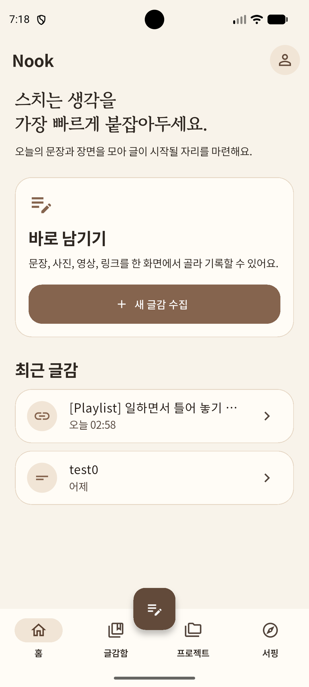 | 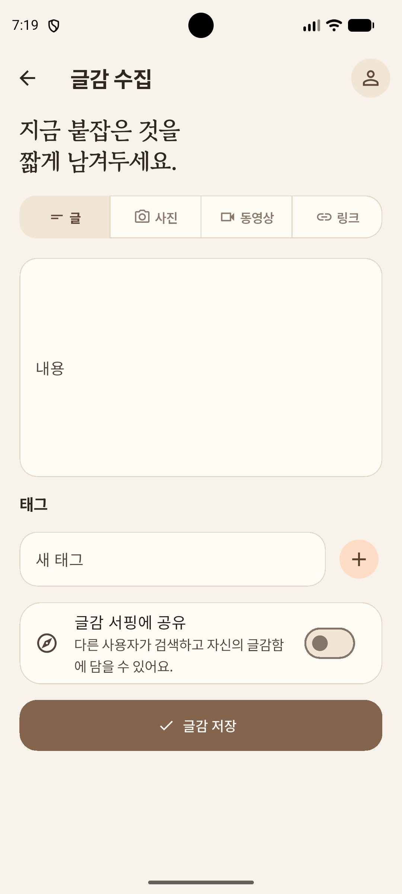 | 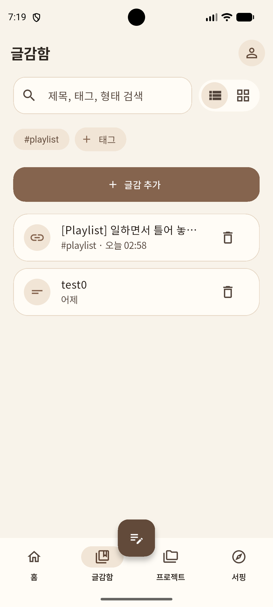 |
| 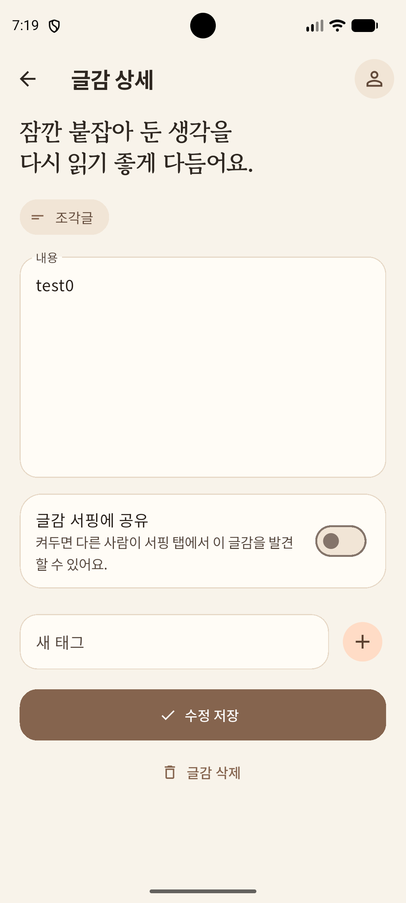 | 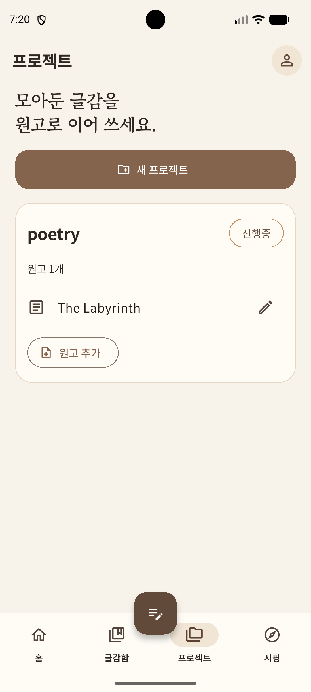 | 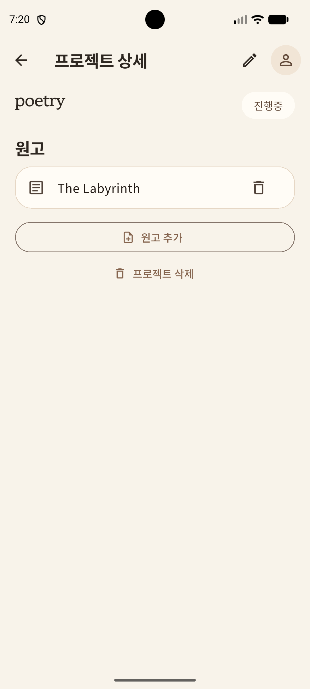 |
| 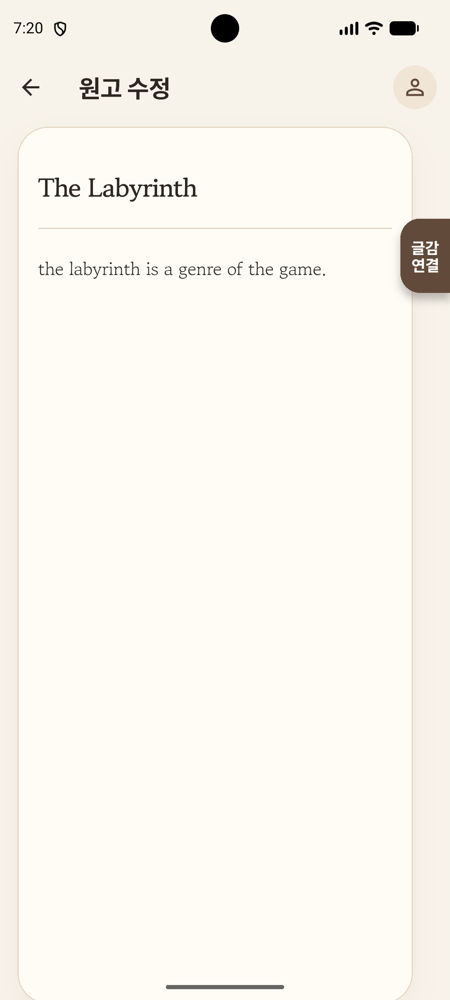 | 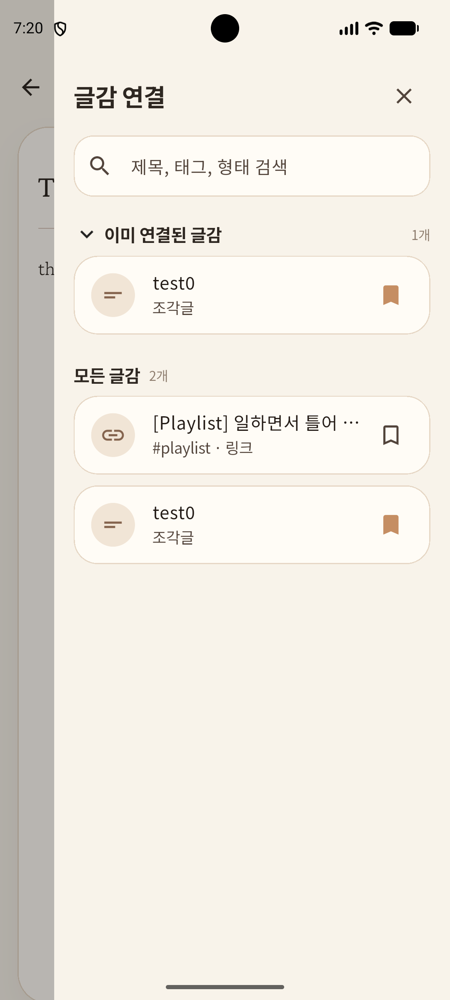 | 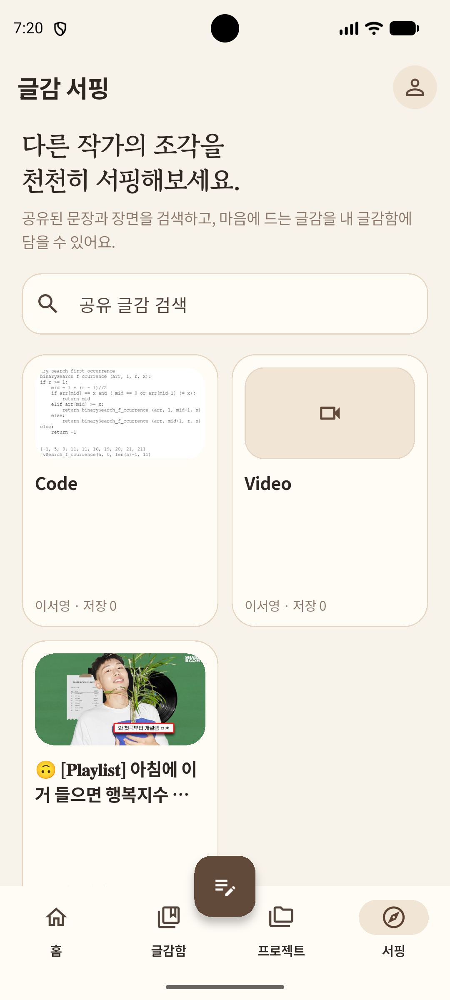 |
| 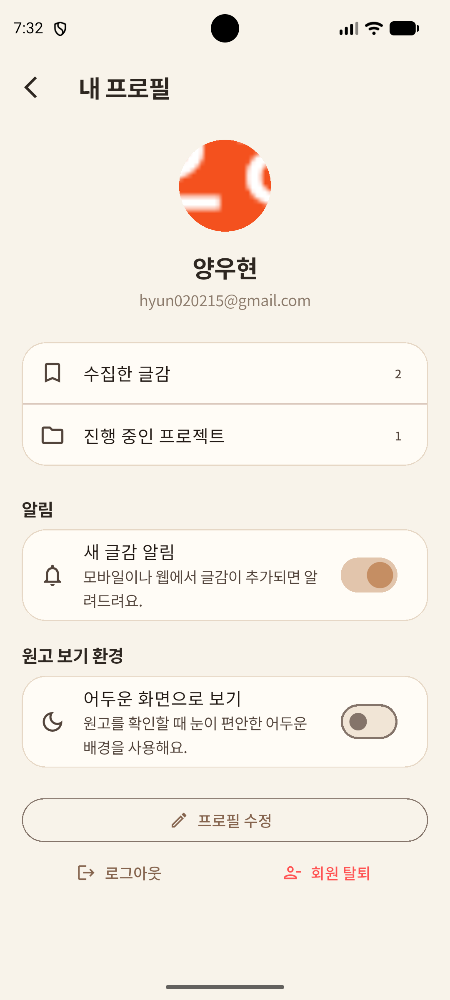 | 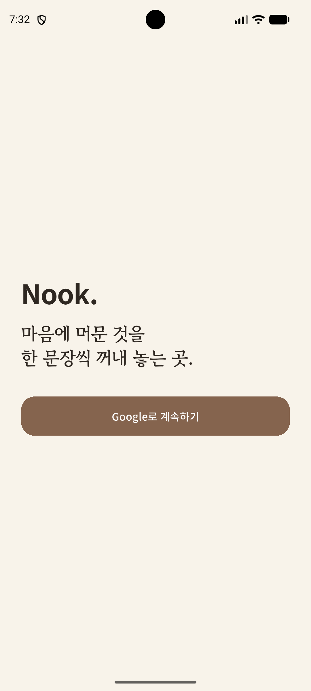 |  |

### 실행 방법

```bash
# Backend
cd apps/backend
cp .env.example .env
npm install
npm run dev

# Web
cd apps/web
cp .env.example .env
npm install
npm run dev

# Mobile (Flutter)
cd apps/mobile
cp .env.example .env
flutter pub get
flutter run

# Desktop (Electron 개발 모드)
cd apps/desktop
cp .env.example .env.local
npm install
npm run dev

# Desktop 배포 빌드
cd apps/desktop
npm run dist
```

### 기술 스택

| 분류 | 사용 기술 |
|---|---|
| 핵심 기술 | Cross-Platform 웹·모바일·데스크탑 데이터 연동 |
| Web | Next.js, TypeScript, CSS |
| Mobile | Flutter, Dart, Supabase Flutter |
| Desktop | Electron, bundled Next server, local offline queue |
| Backend | Node.js, Express, Zod |
| 데이터 저장 | Supabase PostgreSQL, Storage, Row Level Security |
| 인증 | Supabase Auth, Bearer access token |
| 외부 API / 서비스 | 링크 미리보기 대상 웹 페이지, Supabase Storage signed URL |
| 기타 | PDF·DOCX·TXT 생성 라이브러리, Mermaid 문서화 |

---

## 회고 문서

> [KPT 방법론 참고](https://velog.io/@habwa/%EB%8B%A8%EA%B8%B0-%ED%94%84%EB%A1%9C%EC%A0%9D%ED%8A%B8-%ED%9A%8C%EA%B3%A0-KPT-%EB%B0%A9%EB%B2%95%EB%A1%A0)

### Keep — 잘 된 점, 다음에도 유지할 것

- 문제가 발생했을 때 서로 머리를 모아 함께 해결했던 경험이 값지다고 생각한다.
-
-

### Problem — 아쉬웠던 점, 개선이 필요한 것

- 초반에 명세서 등의 문서 작업을 명확히 하지 않았던 점이 이후 개발을 지체시키는 원인이 되었다.
-
-

### Try — 다음번에 시도해볼 것

- Flutter를 써보았으니 React Native 등 다른 프레임워크를 써보면 좋을 것 같다.
-
-

### 팀원별 소감

**양우현:**

> Cross-Platform이 얼마나 어려운지, 특히 모바일 어플리케이션에서 고려할 게 상당히 많다는 사실을 여실히 느낀 프로젝트였습니다. 네이티브 어플리케이션, 웹 연동 방법 등 많은 공부가 된 듯하여 뿌듯합니다.

**이서영:**

> 

---

## 참고 자료

### 실시간 인터랙션

**WebSocket**
- https://developer.mozilla.org/en-US/docs/Web/API/WebSockets_API
- https://techblog.woowahan.com/5268/
- https://tech.kakao.com/posts/391
- https://daleseo.com/websocket/
- https://kakaoentertainment-tech.tistory.com/110

**Socket.IO**
- https://socket.io/docs/v4/
- https://inpa.tistory.com/entry/SOCKET-%F0%9F%93%9A-Namespace-Room-%EA%B8%B0%EB%8A%A5
- https://adjh54.tistory.com/549
- https://fred16157.github.io/node.js/nodejs-socketio-communication-room-and-namespace/

**SSE (Server-Sent Events)**
- https://developer.mozilla.org/en-US/docs/Web/API/Server-sent_events
- https://developer.mozilla.org/ko/docs/Web/API/Server-sent_events/Using_server-sent_events
- https://api7.ai/ko/blog/what-is-sse

**TCP / UDP Socket**
- https://docs.python.org/3/library/socket.html
- https://inpa.tistory.com/entry/NW-%F0%9F%8C%90-%EC%95%84%EC%A7%81%EB%8F%84-%EB%AA%A8%ED%98%B8%ED%95%9C-TCP-UDP-%EA%B0%9C%EB%85%90-%E2%9D%93-%EC%89%BD%EA%B2%8C-%EC%9D%B4%ED%95%B4%ED%95%98%EC%9E%90

**gRPC Streaming**
- https://grpc.io/docs/what-is-grpc/core-concepts/
- https://tech.ktcloud.com/entry/gRPC%EC%9D%98-%EB%82%B4%EB%B6%80-%EA%B5%AC%EC%A1%B0-%ED%8C%8C%ED%97%A4%EC%B9%98%EA%B8%B0-HTTP2-Protobuf-%EA%B7%B8%EB%A6%AC%EA%B3%A0-%EC%8A%A4%ED%8A%B8%EB%A6%AC%EB%B0%8D
- https://tech.ktcloud.com/entry/gRPC%EC%9D%98-%EB%82%B4%EB%B6%80-%EA%B5%AC%EC%A1%B0-%ED%8C%8C%ED%97%A4%EC%B9%98%EA%B8%B02-Channel-Stub
- https://inspirit941.tistory.com/371
- https://devocean.sk.com/blog/techBoardDetail.do?ID=167433

**WebRTC**
- https://developer.mozilla.org/en-US/docs/Web/API/WebRTC_API
- https://webrtc.org/getting-started/overview
- https://web.dev/articles/webrtc-basics?hl=ko
- https://devocean.sk.com/blog/techBoardDetail.do?ID=164885
- https://beomkey-nkb.github.io/%EA%B0%9C%EB%85%90%EC%A0%95%EB%A6%AC/webRTC%EC%A0%95%EB%A6%AC/
- https://gh402.tistory.com/45
- https://on.com2us.com/tech/webrtc-coturn-turn-stun-server-setup-guide/

**QUIC / WebTransport**
- https://developer.mozilla.org/en-US/docs/Web/API/WebTransport_API
- https://datatracker.ietf.org/doc/html/rfc9000
- https://news.hada.io/topic?id=13888

#### KCLOUD VM / Cloudflare Tunnel 환경별 주의사항

| 환경 | 사용 가능(권장) 기술 | 포트/조건 | 주의할 기술 |
|---|---|---|---|
| **로컬 / 일반 VM** | HTTP/REST, WebSocket, Socket.IO, SSE, TCP Socket, gRPC Streaming, WebRTC, QUIC/WebTransport 등 대부분 가능 | 직접 포트 개방 가능. 예: 3000, 5000, 8000, 8080, 9000 등. 외부 공개 시 방화벽/보안그룹/공인 IP 설정 필요 | WebRTC는 STUN/TURN 필요 가능. QUIC/WebTransport는 HTTP/3 · UDP 지원 필요 |
| **KCLOUD VM (VPN 내부)** | HTTP/REST, WebSocket, Socket.IO, SSE, WebRTC 시그널링 | 접속 기기 VPN 필요. 기본 허용 포트: **22, 80, 443**. 개발 포트(3000, 8000, 8080 등)는 직접 접근 제한 가능 | TCP Socket은 포트 제한 있음. gRPC는 HTTP/2 설정 필요. WebRTC 미디어·UDP·QUIC/WebTransport 비권장 |
| **KCLOUD VM + Tunnel** | HTTP/REST, WebSocket, Socket.IO, SSE, WebRTC 시그널링 | VM의 `localhost:<port>`를 도메인에 연결. `localPort`는 **1024~65535**. 예: 3000, 8000, 8080 가능 | 순수 TCP Socket, UDP, WebRTC 미디어/DataChannel, QUIC/WebTransport 불가. gRPC 보장 어려움 |
| **외부 서비스 + 우리 도메인** | HTTP/REST, WebSocket, Socket.IO, SSE, WebRTC 시그널링 | Vercel/Netlify/Railway/Render/AWS/GCP 등에 배포 후 CNAME/A 레코드 연결. 보통 외부는 **443** 사용 | WebSocket/gRPC/TCP/UDP는 플랫폼 지원 여부 확인 필요. 서버리스 플랫폼은 장시간 연결 제한 가능 |
| **서버 없이 외부 SaaS 사용** | Supabase Realtime, Firebase, Pusher/Ably, LLM API Streaming | 직접 포트 관리 불필요. 각 서비스 SDK/API 사용 | 커스텀 TCP/UDP 서버 구현 불가. WebRTC는 STUN/TURN 필요할 수 있음 |

### LLM Wrapper

- https://github.com/teddylee777/openai-api-kr
- https://github.com/teddylee777/langchain-kr
- https://devocean.sk.com/blog/techBoardDetail.do?ID=167407
- https://mastra.ai/docs

### Cross-Platform

- https://flutter.dev/
- https://docs.flutter.dev/
- https://pub.dev/packages/supabase_flutter
- https://pub.dev/packages/image_picker